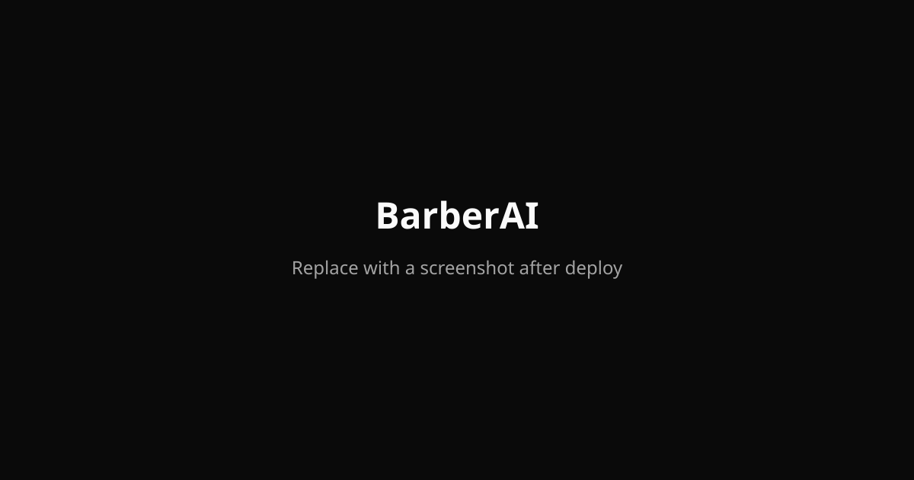

# BarberAI

BarberAI is an AI-powered barbershop booking and style consultation platform. Clients can book appointments and get personalized style recommendations before their visit; barbers can manage services, availability, and grow with a Pro subscription.

**Live demo:** _Add your Vercel URL after deployment_



## Features

- **Smart booking** — Browse barbers, pick a service, choose a time slot, and confirm
- **AI style consultation** — Get Gemini-powered style advice with "what to tell your barber" wording
- **Barber dashboard** — Manage services, availability, and today's appointments
- **Role-based auth** — Separate client and barber experiences via Supabase Auth
- **Stripe subscriptions** — Pro plan upgrade (test mode only)
- **Avatar uploads** — Profile photos via Cloudinary free tier

## Tech Stack

| Layer | Technology |
|-------|-----------|
| Framework | [Next.js 14](https://nextjs.org/) (App Router) |
| Language | [TypeScript](https://www.typescriptlang.org/) (strict) |
| Styling | [Tailwind CSS](https://tailwindcss.com/) + [shadcn/ui](https://ui.shadcn.com/) |
| Database + Auth | [Supabase](https://supabase.com/) |
| AI | [Google Gemini Flash](https://aistudio.google.com/) (free tier) |
| Payments | [Stripe](https://stripe.com/) (test mode) |
| Images | [Cloudinary](https://cloudinary.com/) |
| State | [Zustand](https://zustand.docs.pmnd.rs/) + [React Query](https://tanstack.com/query) |
| Forms | [React Hook Form](https://react-hook-form.com/) + [Zod](https://zod.dev/) |
| Deployment | [Vercel](https://vercel.com/) |

## Local Setup

```bash
git clone <your-repo-url>
cd RazorAI
pnpm install
cp .env.example .env.local
# Fill in .env.local — see SETUP.md for detailed instructions
pnpm dev
```

Open [http://localhost:3000](http://localhost:3000).

> See [SETUP.md](./SETUP.md) for step-by-step account creation (Supabase, Google AI Studio, Stripe, Cloudinary).

## Architecture Decisions

**Why Supabase?** Single platform for PostgreSQL, auth, and row-level security — free tier covers a portfolio project with zero backend code to maintain.

**Why Gemini Flash Lite?** Google AI Studio's free tier (`gemini-2.5-flash-lite`) requires no credit card and handles short consultations well. App-level daily limits (5 free / 50 pro) keep usage predictable.

**Why Cloudinary over Supabase Storage?** Supabase free tier has 1 GB storage; Cloudinary's separate 1 GB free tier is reserved for avatar uploads only, keeping the database storage budget intact.

**Why edge runtime?** Lightweight API routes (bookings, barbers) run on Vercel edge for sub-10s execution. AI and Stripe webhook routes use Node.js runtime for SDK compatibility.

## Free Tier Breakdown ($0/month)

| Service | Free Tier | Usage |
|---------|-----------|-------|
| Vercel | 100 GB bandwidth, serverless functions | Hosting + API routes |
| Supabase | 500 MB DB, 50k MAU, auth emails | Database, auth, RLS |
| Google AI Studio | Free tier (Gemini Flash) | Capped at 5–50/day per user in-app |
| Stripe | Test mode | No real charges |
| Cloudinary | 1 GB storage, 25 credits/month | Avatar uploads only |

**Total running cost: $0** on free tiers.

## Project Structure

```
app/                  → Pages and API routes
components/           → UI and feature components
lib/                  → Supabase, Stripe, Gemini, utilities
supabase/migrations/  → Database schema SQL
```

## Scripts

```bash
pnpm dev      # Start development server
pnpm build    # Production build
pnpm start    # Start production server
pnpm lint     # Run ESLint
```
